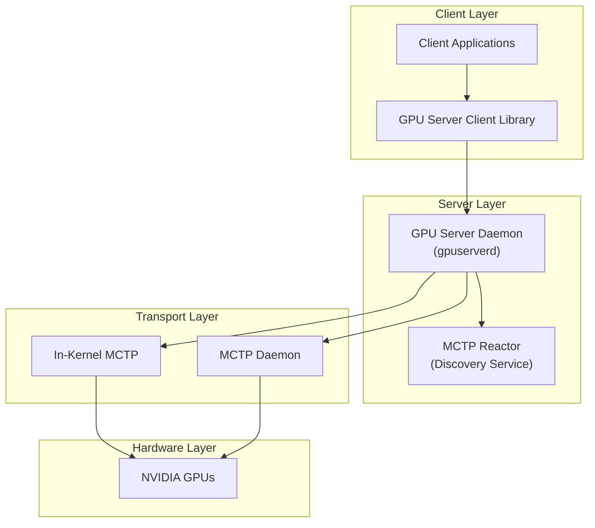
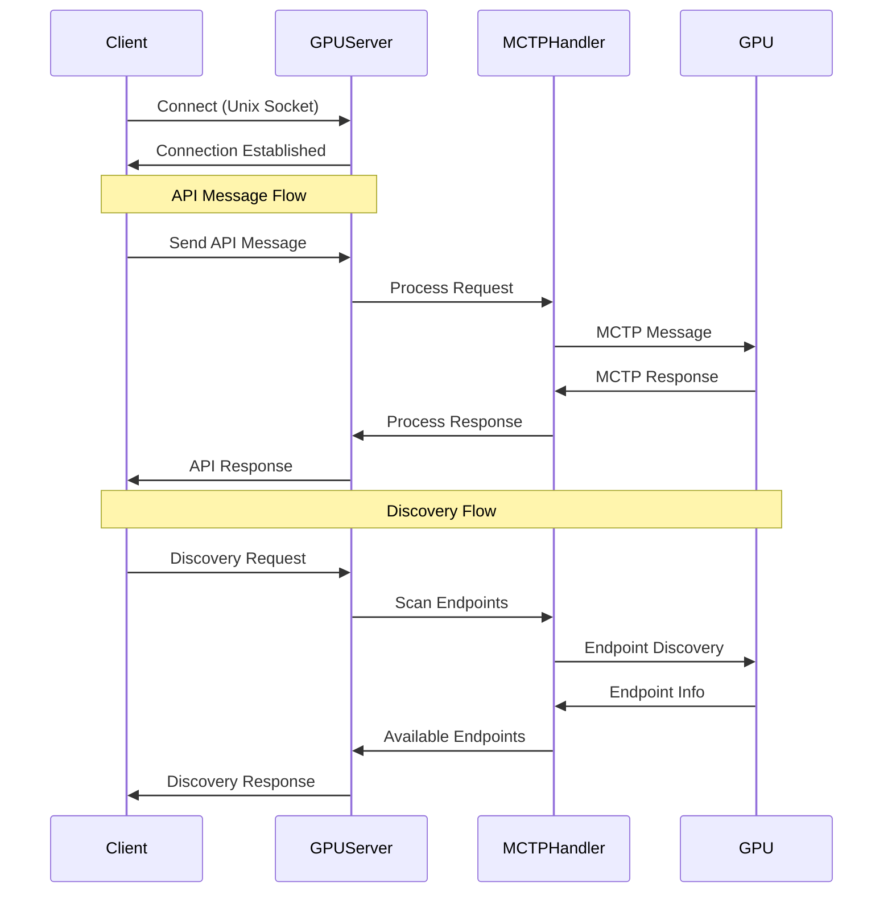

# NVIDIA GPU Server Documentation

## Overview
The NVIDIA GPU Server is a system component that enables communication between system management applications and NVIDIA GPUs using the MCTP (Management Component Transport Protocol) protocol. It provides a unified interface for GPU management operations through both in-kernel and daemon-based MCTP implementations.

## Architecture

## Message Flow

## Core Components

### 1. GPU Server Daemon (gpuserverd)
- Main server process that handles client connections
- Manages communication between clients and GPUs
- Supports multiple concurrent client connections
- Handles request routing and response management

### 2. MCTP Reactor
- Handles MCTP endpoint discovery
- Manages endpoint registration and deregistration
- Provides dynamic endpoint configuration

### 3. Transport Handlers
- **In-Kernel Handler**: Direct kernel MCTP communication
- **Daemon Handler**: MCTP daemon-based communication
- Abstracts transport layer details from upper layers

### 4. Client Library
- Provides C API for client applications
- Handles connection management
- Implements message formatting and parsing
